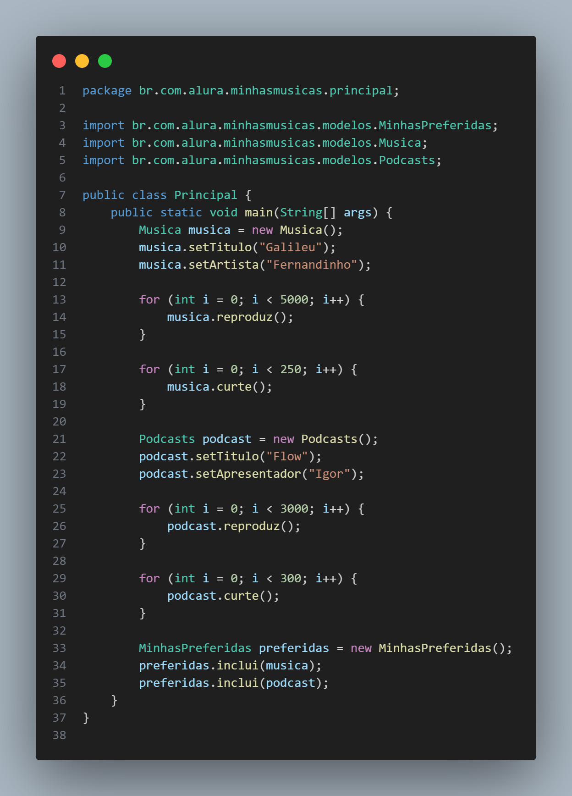

# 🎵 Desafio Música

Este projeto foi desenvolvido como parte de um desafio de lógica e estruturação de dados, utilizando **Java**. A proposta é simular um sistema simples de gerenciamento de músicas.

## 🎵 Funcionalidades

- Adicionar músicas ao sistema.
- Exibir informações sobre as músicas.
- Verificar se uma música é preferida ou não.

## 📷 Código Principal

## 💡 Objetivo

O desafio tem como foco a prática de:

- Aplicação de orientação a objetos (POO)
- Estruturação de código limpo e reutilizável

## 📚 Classes

### 🎵 Musica

Representa uma música com atributos como nome, artista e gênero.

### 🎵 MinhasPreferidas

Utiliza if e else para definir se uma música é preferida ou não.

### 🎵 Principal

Executa o programa e permite a interação com as funcionalidades.

## 🛠 Tecnologias Utilizadas

## 📂 Como Executar

1. Clone este repositório em sua máquina local.
2. Abra o projeto em sua IDE de preferência.
3. Execute a classe `Principal` para iniciar o programa.
4. Siga as instruções no console para adicionar músicas e verificar preferências.

## 🔗 Links Úteis

- [Java Documentation](https://docs.oracle.com/en/java/)
- [VS Code](https://code.visualstudio.com/)
- [Git](https://git-scm.com/)
